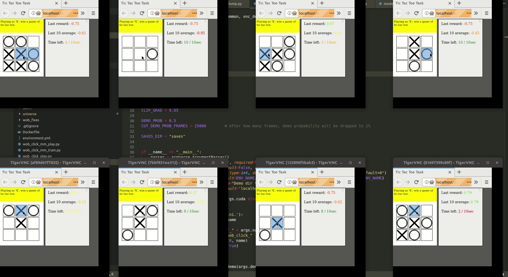

# Jiminy - An imitation learning library



##### (This repository is in pre-alpha stage. Expect a lot of errors.)


Jiminy is an imitation learning library that uses VNC as an interface, and is meant to train agents on any environment(starting with World-of-Bits) tasks.

Minimum requirements: 

1. Python >=3.5 (preferably in virtualenv or conda)
2. Golang >=1.10
3. numpy  
4. [docker-compose](https://docs.docker.com/compose/install/) (install on Linux using `./utils/install_compose.sh`)


### How to run sample:

#### 1. Run remote environment:

```

docker run -it -p 5900:5900 -p 15900:15900 -p 90:6080 --ipc host --privileged --cap-add SYS_ADMIN sibeshkar/jiminywob:latest

```

You can view the environment at `HOSTNAME:90` in your browser. 

#### 2. Install Jiminy in virtualenv/conda :

```
git clone https://github.com/sibeshkar/jiminy
pip install -e .

```

#### 3.Install requirements for running agents, and run sample random agent:

Above command should open a terminal to the container. Inside the container, run the sample agent like this:

```

cd examples
pip install -r requirements.txt
./wob_remotes_new.py

```

Wait a few moments for the remote environment to reset to the sample environment that the agent uses : `wob.mini.BisectAngle-v0`. Check `docker logs` of the remote environment container if this agent fails to connect. This agent interacts with the environment inside the remote container and returns a tuple of the form `(observation, reward, is_done, info)` with every interaction.

  
### Infrastructure Overview:
The core Jiminy infrastructure allows agents to train in parallel environments for asynchronous methods for RL (i.e A3C). This remote docker image starts a TigerVNC server and boots a Python control server, which uses Selenium to open a Chrome browser to an in-container page which loads [MiniWoB](https://stanfordnlp.github.io/miniwob-plusplus/) environments. The `utils` folder contains helpful bash files to handle the architecture. 

Follow these instructions to use:
1. Change directory to `utils`
2. Start 8 remote environments in docker containers, and dashboard - `docker-compose -f docker-compose-remotes.yaml --compatibility up -d` 
2. View the environments while training at `HOSTNAME:80` in the browser
3. After completion, clean up using `docker-compose -f docker-compose-remotes.yaml down`

### Training an A3C agent from scratch:

Jiminy contains an example for training agents using A3C methods from scratch.  Follow these steps to reproduce: 

1. Clone and install this repository (preferably in virtualenv or conda). `pip install -e .`
2. Start 8 remote environments after changing into `utils` directory : `docker-compose -f docker-compose-remotes.yaml --compatibility up -d`
3. [OPTIONAL] Open VNC viewer dashboard in browser : `HOSTNAME:80`
4. Move into the examples directory : `cd examples`
5. Install requirements for the agent: `pip install -r requirements.txt`
6. Train the agent : `./wob_click_train.py -n t1 --cuda` (t1 is the name of the iteration)

All runs are stored in the `./examples/runs/` directory , and best models are stored in `./examples/saves/`. You can inspect the training by starting `tensorboard --logdir=runs` in a separate terminal.

On a GTX 1050Ti, the above takes one hour, i.e. 100K-150K frames to get to a mean reward of 0.9. 

If you just want to see how Jiminy handles arrays of tuples of the form `(observation_n, reward_n, done_n, info)` from the parallel environments, just run ./wob	

### Recording Demonstrations:

Start the environment `wob.mini.ClickTest2-v0` in a container. This exposes a port with rewarder and VNC proxy.

1. Change directory to `utils`
2. Set environment variable : `export ENV_NAME=wob.mini.ClickTest2-v0`
3. Run `docker-compose -f docker-compose-demo.yaml --compatibility up -d`
4. To record demonstrations, visit the noVNC client at `HOSTNAME:6080` and connect using password : `boxware`
5. After recording demonstrations, disconnect noVNC using the panel or close the tab.

All recorded demonstrations are stored inside `/tmp/completed-demos` inside the container, and will be automatically transferred to the `examples/completed-demos` directory on your machine. 

#### Coming soon:
1. How to record and play demonstrations
2. Using demonstrations during training